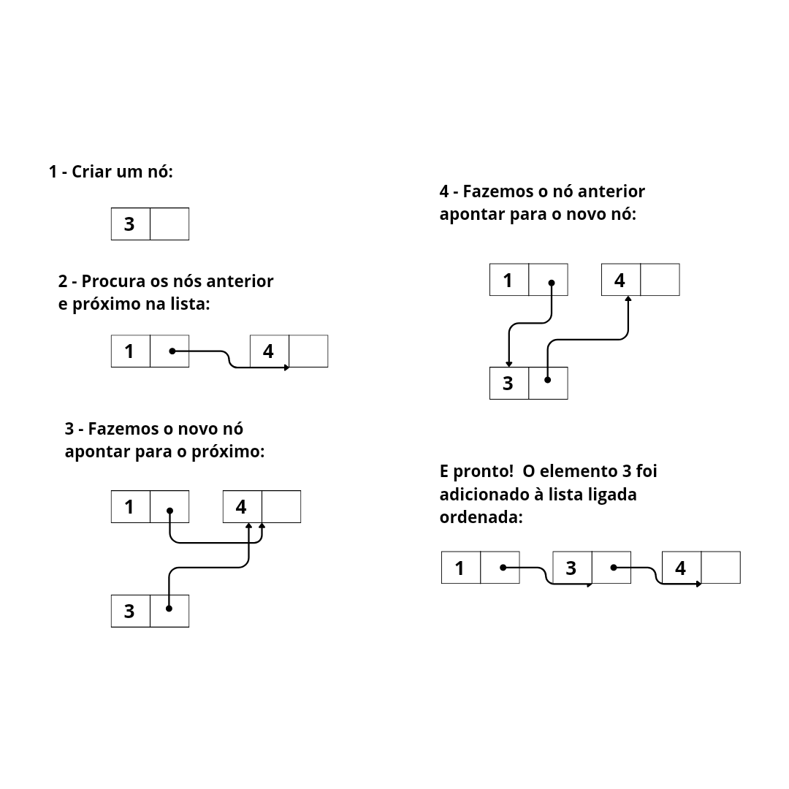

# Lista Ligada Ordenada

Vimos anteriormente um exemplo de lista ligada, onde os elementos eram de diferentes tipos e sem uma ordem específica. Porém, muitas vezes é útil que essa lista esteja ordenada em relação a um conjunto de valores.

Como estamos utilizando estruturas ligadas e dinâmicas fica impraticável aplicar algoritmos específicos de ordenação depois da inserção desses elementos.

Assim, para que a estrutura ligada seja ordenada podemos definir algumas condições antes de inserir os elementos.

## Sobre o código

Assim como nos exemplos anteriores, teremos uma classe `No`. No entanto, os valores serão inteiros:

```python
class No:
    def __init__(self, valor=None):
        self.valor: int = valor
        self.proximo: "No" = None
```

A classe `ListaLigadaOrdenada` irá manipular os nós e terá um atributo `primeiro` para guardar o primeiro elemento da lista:

```python
class ListaLigadaOrdenada:
    def __init__(self):
        self.primeiro: "No" = None
```

### Verificar se a lista tem elementos

Para verificar se a lista está vazia basta verificar se o primeiro elemento está vazio:
```python
# ... Resto do código

class ListaLigadaOrdenada:

    # ... Os outros métodos
    
    def esta_vazia(self):
        return self.primeiro == None
```

### Método auxiliar de pesquisa

Para uma melhor visualização vamos criar um método auxiliar de busca chamado `buscar_no_anterior_e_proximo()`. Esse método recebe um valor, verifica se existe algum nó com valor maior ou igual a esse valor recebido e, se existir, retorna esse nó o e nó anterior a ele. 

```python
# ... Resto do código

class ListaLigadaOrdenada:

    # ... Os outros métodos
    
    def _buscar_no_anterior_e_proximo(self, valor):        
                
        if self.esta_vazia():
            return None, None
                                   
        anterior = self.primeiro        
        fim_da_lista = None   
                            
        while anterior.proximo != fim_da_lista:
            if valor <= anterior.proximo.valor:                                                       
                break
            anterior = anterior.proximo             
         
        return anterior, anterior.proximo             
```

Por exemplo, se estamos procurando o valor 3 na lista [1,2,3] o método retornará os "nós" correspondentes aos valores 2 e 3. Isso porque precisamos saber o nó anterior a um certo elemento na lista para podermos remover e adicionar itens na ordem correta. 

### Adicionando itens na lista

Para adicionarmos elementos na lista devemos seguir os passos:

  * Receber um valor e criar um nó com ele;
  * Se a lista está vazia, o novo nó se torna o primeiro elemento da lista;
  * Se já existirem elementos na lista e o valor do novo nó é menor que o valor do primeiro nó, adicionamos o novo nó no início da lista;
  * Caso contrário, percorremos a lista até encontrar a posição correta para inserir o novo nó, mantendo a lista ordenada.

Assim, a inserção do novo nó será feita entre "nós", na primeira posição ou na última posição da lista:

```python
# ... Resto do código

class ListaLigadaOrdenada:

    # ... Os outros métodos
    
    def adicionar(self, valor): 
        novo = No(valor)         
        if self.esta_vazia():
            self.primeiro = novo
        elif valor <= self.primeiro.valor:
            novo.proximo = self.primeiro
            self.primeiro = novo    
        else:
            anterior, proximo = self._buscar_no_anterior_e_proximo(novo.valor)                                                                                              
            novo.proximo = proximo
            anterior.proximo = novo

```

A imagem abaixo ilustra a lógica que seguimos para manipular os ponteiros e inserir o novo elemento. Suponha a lista [-2, 1, 4, 6]. Vamos adicionar o elemento 3:



### Removendo itens da lista

Passos para a remoção de elementos da lista:

  * Verificamos se a lista está vazia. Se a lista estiver vazia não há nada para remover;
  * Se existirem elementos na lista, verificamos se o nó que será removido é o primeiro nó da lista. Caso seja, atualizamos o atributo `primeiro` para o próximo nó da lista;
  * Caso o nó a ser removido não seja o primeiro, fazemos uma busca na lista para encontrar o nó que será removido e o nó anterior a ele;
  * Se o nó pesquisado e o nó anterior a ele existirem na lista, fazemos o ponteiro `proximo` do nó anterior apontar para o `proximo` do nó pesquisado.

```python 
# ... Resto do código

class ListaLigadaOrdenada:

    # ... Os outros métodos
    def remover(self, valor):
    
        if self.esta_vazia():
            return None
        elif valor == self.primeiro.valor:
            self.primeiro = self.primeiro.proximo
        else:
            anterior, no_buscado = self._buscar_no_anterior_e_proximo(valor)
            if no_buscado != None and valor == no_buscado.valor:                            
                anterior.proximo = no_buscado.proximo            	      

```
---

Você pode conferir o código completo em [lista_ligada_ordenada.py](https://github.com/minha-logica/estruturas-de-dados-em-python/blob/master/lista-ligada-ordenada/lista_ligada_ordenada.py)

Outros exemplo de estruturas:
  * [Fila](https://github.com/minha-logica/estruturas-de-dados-em-python/tree/master/Fila)
  * [Pilha](https://github.com/minha-logica/estruturas-de-dados-em-python/tree/master/pilha)
